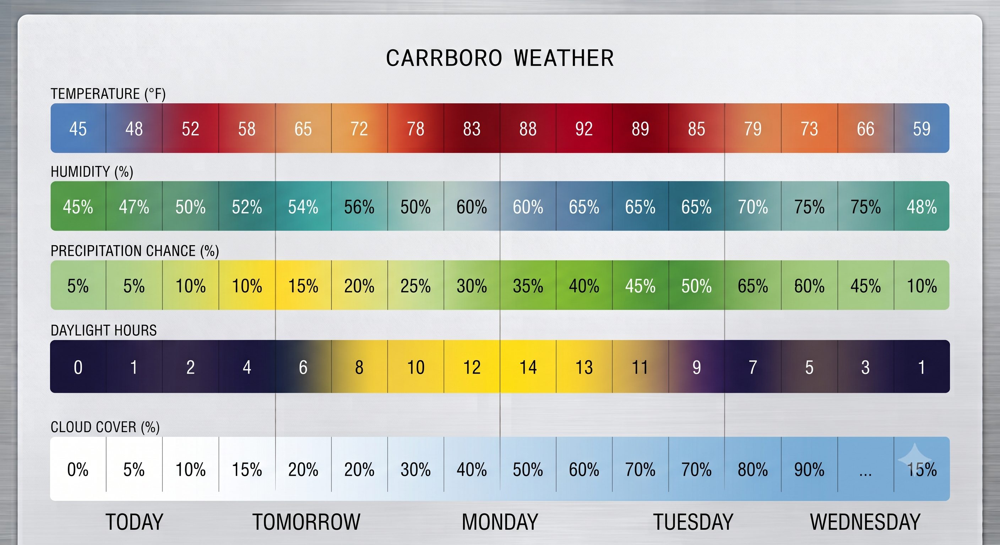

# Carrboro Weather Dashboard

An interactive, live weather forecasting, astronomical, and aerospace dashboard crafted in an elegant alabaster-cream and brushed metal aesthetic.



## Highlights & Visual Graphics

1. **Weather Heatmap & Forecast**:
   - 8 intervals per day (every 3 hours) displaying real-time Temperature, Humidity, Precipitation Chance, Daylight solar spectrum, and Cloud Cover.
   - Dual Modes: **Snapshot Mode** and **Live Forecast Mode** (powered by Open-Meteo).
   - Global city search with geocoding autocomplete and instant °F / °C toggling.

2. **Area Doppler Radar**:
   - High-resolution interactive weather radar centered over Carrboro / Central North Carolina (RainViewer real-time radar layer with Leaflet).

3. **Earth in Sunlight**:
   - Real-time orthographic planetary globe rendering the current day/night solar terminator and live planetary imagery.

4. **Live Solar System View**:
   - Real-time Keplerian orbital simulation (NASA JPL parameters) calculating exact heliocentric positions of the Sun, all 8 planets, the Moon, Saturn's rings, and the Asteroid Belt.
   - Inner 4 vs All 8 toggle, real-time tooltips, and interactive high-resolution modal.

5. **Live Airspace Flight Radar**:
   - 150-mile radius live polar radar tracking all active aircraft in the local airspace around Carrboro / RDU via OpenSky Network ADS-B telemetry.
   - Real-time rotating radar sweep, heading-aligned aircraft silhouettes, altitude color-coding, beacon markers (RDU, GSO, CLT, FAY, RWI), and searchable flight manifest table.

6. **Mobile PWA & Remote Access**:
   - Progressive Web App support (`manifest.json`, high-res icons, mobile meta tags).
   - Installable directly to your phone's home screen for native fullscreen experience.

---

## Deploy to Cloud (24/7 Access Anywhere)

### Option A: Render.com (Recommended - 1 Click Free)
1. Go to [Render Dashboard](https://dashboard.render.com).
2. Click **New +** → **Web Service**.
3. Select your GitHub repository: `mckalav-prog/carrboro-weather`.
4. Render will automatically detect the settings from `render.yaml` / `Dockerfile`.
5. Click **Deploy Web Service** to receive your permanent URL (e.g. `https://carrboro-weather.onrender.com`).

### Option B: Docker
```bash
docker build -t carrboro-weather .
docker run -p 8080:8080 carrboro-weather
```

### Option C: Run Locally
```bash
python3 server.py 8080
```
Then open [http://localhost:8080](http://localhost:8080) in your browser.
